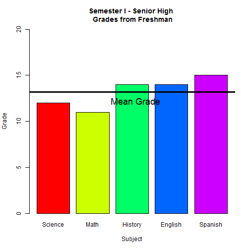

My First Shiny Application 
========================================================
author: Heidi Joy Guenther
date: 11/20/2015
font-family: 'Courier New'

<small>
Created for Course Project in Developing Data Products
</small>

Purpose of My Shiny App
========================================================
- This application was created for a school I worked for in Lima Peru<small>
  - Small k-12, where there is one classroom for each grade
  - The grades with two classrooms have a designation of either "Mandela" or "Ghandi"
  - The class scores are based on a scale of 0-20 </small>
  
***

- Functions as a way the school may visualize the scores for each classroom
- Purpose is to produce charts used for teacher conferences
- Will be modified for use by the school in the future<small>
  - Classroom Subjects changed for relevance for each class/grade 
  - Language changed to spanish </small>
  
Application Description
========================================================
The application inputs
- Current Semester
- Classroom Grade
- Classroom Designation (for grades that have more than one class)

<small> And average score for class in </small>
-
     Science
     Math
     History
     English
     Spanish

Application Description
========================================================
The application outputs
- Bar chart depicting average score for each subject
- Reactive output: Line across bar chart computing mean of all subjects
- Reactive output: Mean of subjecs for the class written below chart

Example Plot
========================================================

 
